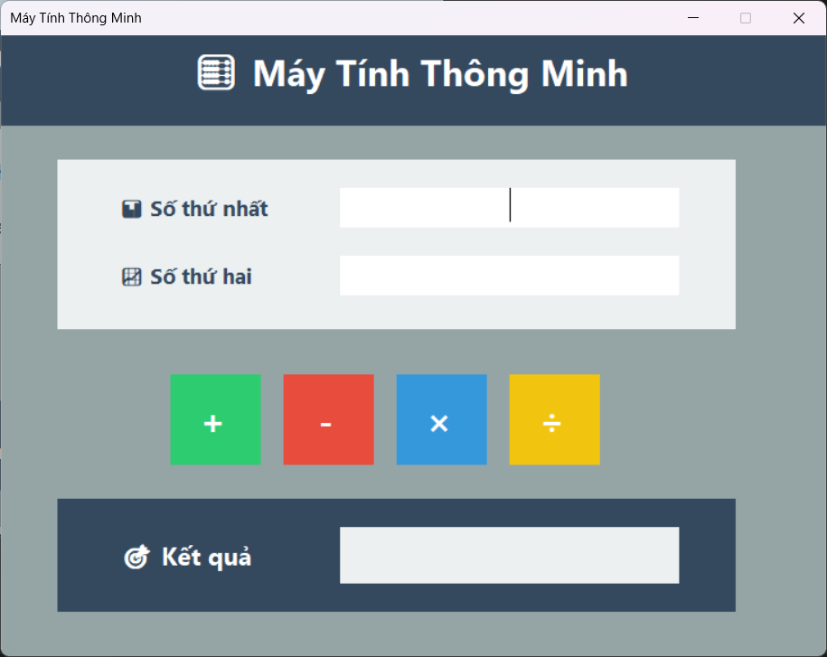
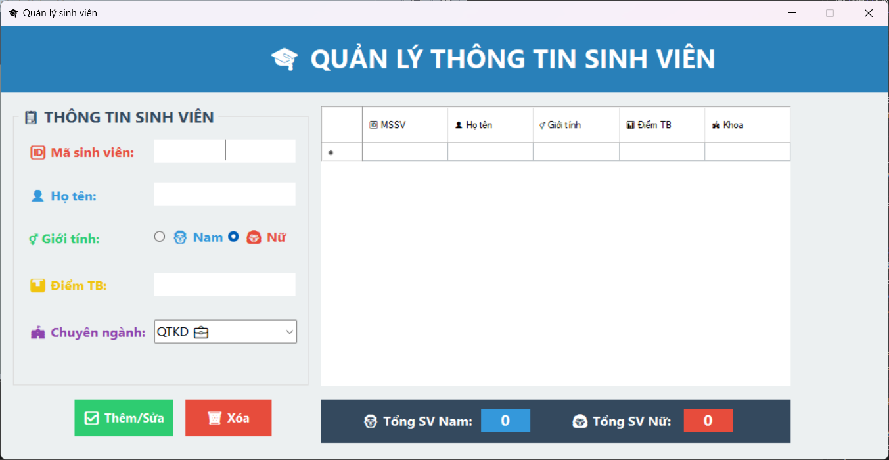
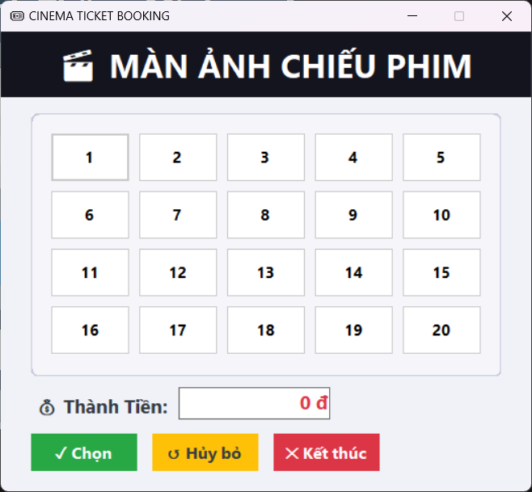
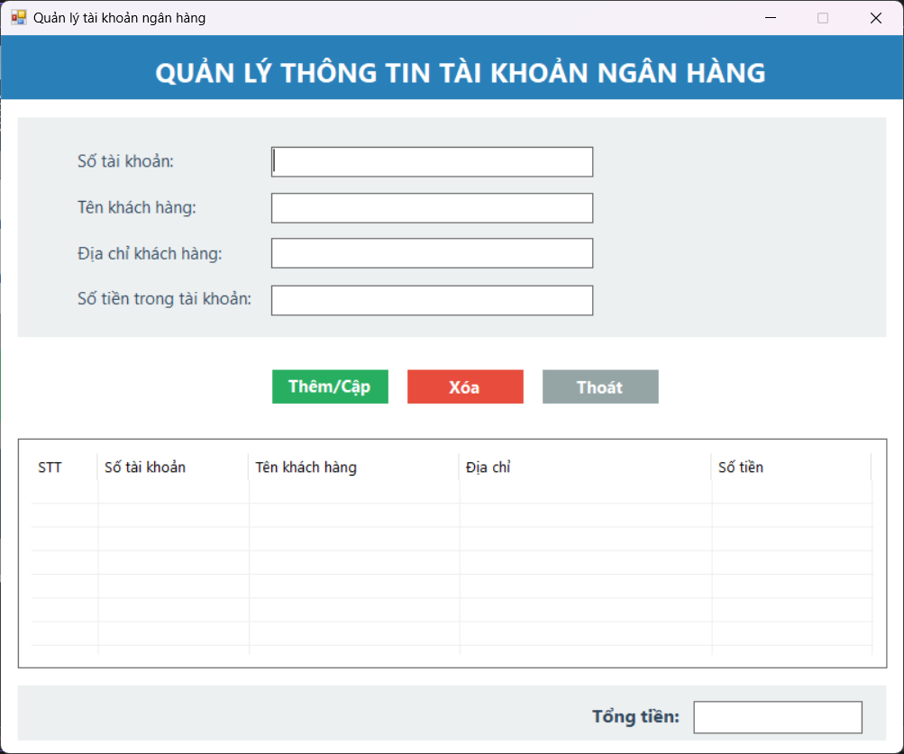

# 🎬 TH_LapTrinhWin

> 💻 Môn học: Thực hành lập trình Windows  
> 📅 Bài tập: Buổi 2  
> 👨‍💻 Sinh viên: Trần Văn Trung (MSSV: ...)

---

## 📸 Giao diện phần mềm

### 1. Màn hình chính

### 2. Chọn ghế xem phim

### 3. Sau khi chọn ghế

### 4. Thông báo và tính tiền

---

## 🛠️ Công nghệ sử dụng

- Visual Studio 2022
- C# WinForms
- .NET Framework 4.x

---

## 📁 Cấu trúc thư mục

